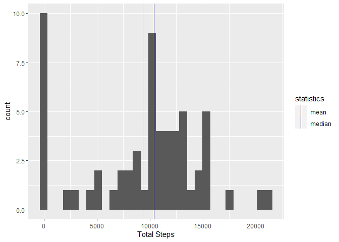

## Loading and preprocessing the data
Loading the libraries that will be used to preprocess, analyse and generate the graphics of the data.

```r
library(stringr)
library(lubridate)
library(ggplot2)
library(stringr)
library(dplyr)
library(purrr)
library(timeDate)
```
Loading and changing the data format.

```r
unzip("activity.zip")
df <- read.csv("activity.csv")
df$interval <- as.numeric(df$interval)
df$date <- ymd(df$date)
summary(df)
```

```
##      steps             date               interval     
##  Min.   :  0.00   Min.   :2012-10-01   Min.   :   0.0  
##  1st Qu.:  0.00   1st Qu.:2012-10-16   1st Qu.: 588.8  
##  Median :  0.00   Median :2012-10-31   Median :1177.5  
##  Mean   : 37.38   Mean   :2012-10-31   Mean   :1177.5  
##  3rd Qu.: 12.00   3rd Qu.:2012-11-15   3rd Qu.:1766.2  
##  Max.   :806.00   Max.   :2012-11-30   Max.   :2355.0  
##  NA's   :2304
```
## What is mean total number of steps taken per day?

The code below generates a histogram for the total number of steps per day.

```r
stepsPerDay = df %>% group_by(date) %>% summarise(totalSteps = sum(steps,na.rm = T))
stepsMean <- round(mean(stepsPerDay$totalSteps),2)
stepsMedian <- median(stepsPerDay$totalSteps)
ggplot(data=stepsPerDay) + geom_histogram(aes(totalSteps)) + 
        geom_vline(aes(xintercept = stepsMean, color="mean")) +
        geom_vline(aes(xintercept = stepsMedian, color="median")) +
        labs(x="Total Steps") + 
        scale_color_manual(name = "statistics", values = c(median = "blue", mean = "red"))
```

<!-- -->

We are able to see that the most frequent amount of steps are close to zero, occurring in 10 days.
The mean and median are quite close, being respectively 9354.23 and 10395.

## What is the average daily activity pattern?
The code below generates a time series plot of the average number of steps taken per 5-minute interval.


```r
averagedSteps <- df %>% group_by(interval) %>% summarise(average = mean(steps,na.rm=T))
with(averagedSteps, plot(interval,average, type="l"))
```

<!-- -->

```r
maxAverage <-max(averagedSteps$average)
maxInterval <- with(averagedSteps, interval[which(average==maxAverage)])
```
The interval which contains the largest number of steps is around 835, having an average of 206.1698113 steps.

## Imputing missing values

We've seen in the beginning of the report that the dataset total number of NAs are 2304. The code below replaces the NAs value using the average by interval, which is already calculated in the averagedSteps dataframe. Then, it generates a new histogram for the total number of steps per day.

```r
dfWithoutNa <- df
dfWithoutNa$steps <- ifelse(is.na(df), averagedSteps$average[which(averagedSteps$interval==df$interval)],df$steps)
stepsPerDayWithoutNa = dfWithoutNa %>% group_by(date) %>% summarise(totalSteps = sum(steps,na.rm = T))
stepsMeanWithoutNa <- round(mean(stepsPerDayWithoutNa$totalSteps),2)
stepsMedianWithoutNa <- median(stepsPerDayWithoutNa$totalSteps)
ggplot(data=stepsPerDayWithoutNa) + geom_histogram(aes(totalSteps)) + 
        geom_vline(aes(xintercept = stepsMeanWithoutNa, color="mean")) +
        geom_vline(aes(xintercept = stepsMedianWithoutNa, color="median")) +
        labs(x="Total Steps") +
        scale_color_manual(name = "statistics", values = c(median = "blue", mean = "red"))
```

<!-- -->
We are able to see that the frequency of the short amount of steps has fallen and the graphic has been pushed significantly to the right. The new mean and median values are respectively 28239.18 and 31185.

## Are there differences in activity patterns between weekdays and weekends?

The code below generates as panel plot that enables us see the difference of activity of the weekdays and weekends.

```r
dfWithoutNa$typeDay <- factor(isWeekday(dfWithoutNa$date), levels = c(T, F), labels = c("Weekday","Weekend"))
averagedStepsWithoutNa <- dfWithoutNa %>% group_by(interval, typeDay) %>% summarise(average = mean(steps,na.rm=T))
ggplot(data=averagedStepsWithoutNa, aes(interval, average)) + geom_line() + facet_wrap(.~typeDay,nrow=2)
```

<!-- -->

We are able to see that on weekends, the number of steps is far below in the early mornings and in the afternoon is a little above,
